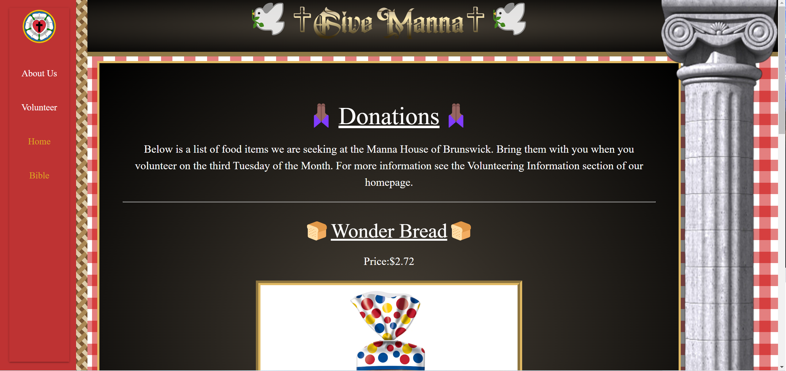

# Give Manna

## What is Give Manna
We are Give Manna, we are a community based organization that supports Non-Profit Church Organizations.

## Description
Users are able to find information on non profit organization, they will be able to check weather for the location of the non profit organization and check what foods are used and then those food can be donated to the non profit organization.
We have learned how to use different APIs rather than ones previously learned, we used a different CSS libary than bootstrap we used Materialize, learned how to put information from an API into local storage we help speed up fetch queues.
Some future improvements to the site that we want to put are adding forms for users to put food that they would like to see being given out and a place to simply order it from the website.

## User Story
AS A volunteer 
I WANT to go on the church's nonprofit website 
SO THAT I can submit my name, check the weather, and sign up to donate food 

## Acceptance Criteria
GIVEN a website from Give Manna 
WHEN I access the web page 
THEN I am presented with the organization's information 
WHEN I scroll down 
THEN I am presented with today's weather, a map for the church's location, and a form to input my information 
WHEN I click on the donation link located on the navigation bar 
THEN I can see what food is being used so I can donate said food 

## Contributors
Ava Blake 
Khanh Bui 
Brandon Rodriguez 

## Two APIs
**Accuweather-** Accuweather API  allows easy access to the most accurate, detailed weather data to develop innovative new weather experiences. 
**BlueCartAPI-** BlueCart API is the real-time Walmart Product Data API you've been looking for.

## Link to live Webpage

## Screenshot of Webpage

